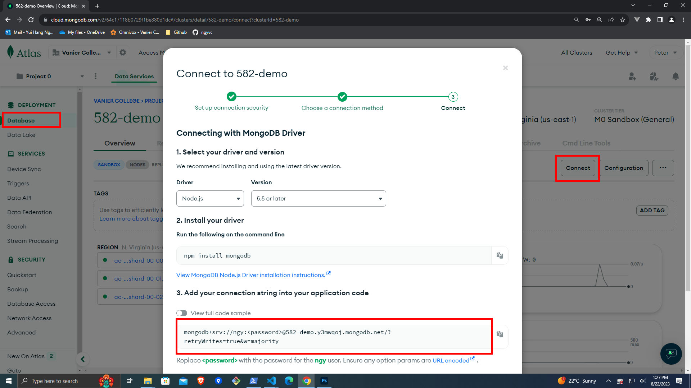
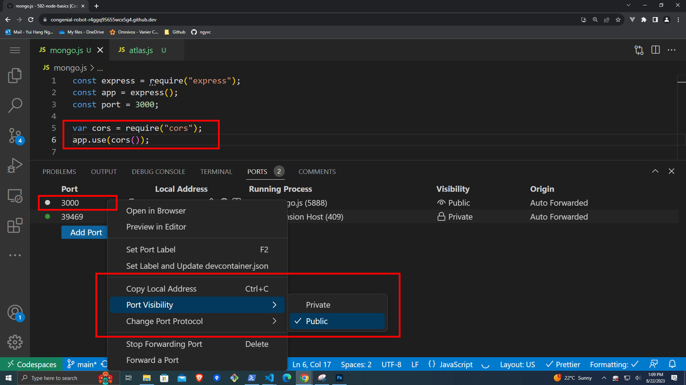
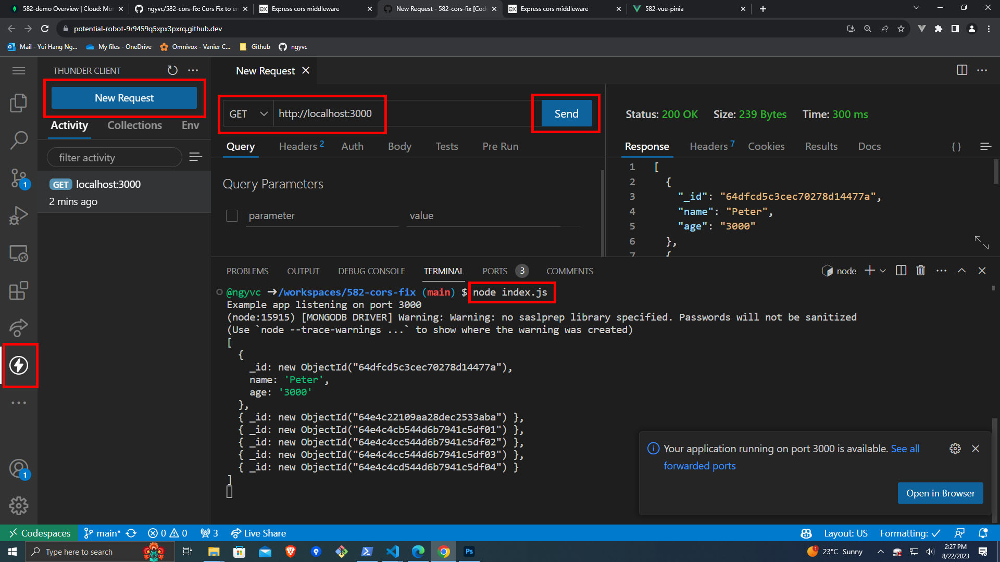

# 582-cors-fix

Cors Fix to enable Codespace to connect to Vue and to MongoDB Atlas.

## MongoDB Atlas Network Access


Log in to MongoDB Atlas, select Network Access on the side menu and click on `Add IP Address`. Once you see the dialog box for 'Add IP Address List Entry', select `ALLOW ACCESS FROM ANYWHERE` and `Confirm`.

## MongoDB Atlas Connection String



Log in to MongoDB Atlas, select Database on the side menu, select your database and click on `Connect`. Once you see the dialog box for 'Connect', select `Connecting with MongoDB Driver` and follow the instructions. You will need to **copy** the connection string that is displayed and **do not forget to change your password** enclosed in `<password>`.

## Enabling CORS access to COdespace



Add and use the [cors middleware](https://expressjs.com/en/resources/middleware/cors.html) to to enable CORS with various options.

```js
var cors = require("cors");
app.use(cors());
```

Using cors this way will **enable All CORS Requests**.

Once your server is running, make sure you `right-click` on your outgoing port (usually 3000) and set `Port Visibility` to `Public`.

This will expose your Codespace application to **_any public_**.

## Project setup

I would recommend you do the following commands:

`npm init`

to start a package file for your node project.

You will most likely need to install Express, MongoDB and CORS modules and middleware.

`npm install express --save`

`npm install mongodb --save`

`npm install cors --save`

You will also need to add in a `.gitignore` file with `node_modules` inside to ignore all node modules you will have to install.

When you are ready with your project, start your server by running:

`node index.js`

For sample file, view [index.js](index.js)

## Thunder Client to initialize external ports

You **may** need to use Thunder Client to make a first request once your ports are made Public to be able to view it from any browser or web services.


